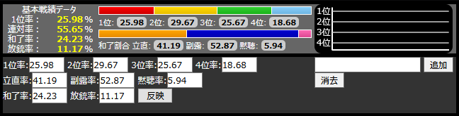
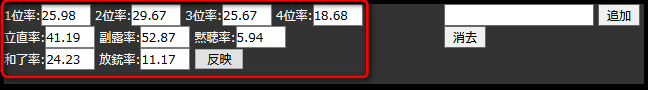
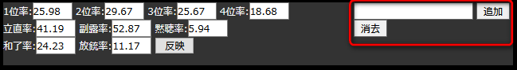
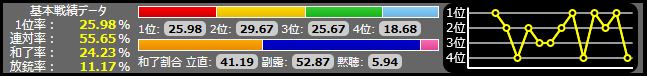

# 桃色大戦ぱいろん 生放送用成績表示ツール

とっくの昔にサービス終了したゲームですが、ニコニコ生放送(配信)の配信者画面に表示するパーツをHTML/CSS/JavaScriptで制作していたので少し解説します。

# Example

1. 「viewer.html」をブラウザで起動します。
    - 作成当初は問題ありませんでしたが、現在はローカルのファイルに対して必ずクロスオリジン扱いになる制約があるので表示できません。これを解消するためには、ブラウザの設定を変更し、セキュリティを無効にする必要があります。
    - まあ、これを実行すると危険性が上がるのであまりお勧めはできませんが、古いアプリなので許容してください(ぇ
2. クロスオリジンの問題がない場合、戦績画面が表示されます。
    - この戦績画面の上半分(背景のグレーが薄い部分)が生放送画面に表示する領域です。OBSなどでこの部分の領域を切り取り、配信画面に合成します。
    - 戦績画面の下半分(背景のグレーが濃い部分)は、上半分の表示内容を変更するために用いる操作パネルです。使い方は「Usage」を確認してください。



3. しばらく待つとぱいろんのカード画像と、キャラクターのセリフを使用したアニメーションが始まります。
    - 下記のアニメーションgifは表示例です。カードの並び順や、どのキャラクターのセリフが表示されるかは乱数で決定されます。
    - キャラクターのセリフは、ぱいろんログイン時のキャラボイスをテキスト起こししたものを利用しています。


# Installation

[注意]

カード画像を準備することが困難だと思われますので、このアプリの動作を再現する方法は実質的にありません。

1. このリポジトリをcloneします。
2. `character.xml`内の`<picture>`要素に指定されているカード画像データを用意します。
    - この画像データは作者が自身で集めましたが、さすがに公開することはできないのでgithubリポジトリには含まれていません。
    - ですので実質的に再現は不可能です。。。。
    - 例として、下記の神代フレイヤちゃんのカードデータの場合は、リポジトリの直下にある`SPList`ディレクトリの中に`Fureiya.png`という画像ファイルを置くと参照されるようになります。
    ```xml:character.xml
    <cd>
		<name>神代フレイヤ</name>
		<age>17</age>
		<comment>「え？カチューシャが動いた？ちょっと何を言ってるのか分からなーい」</comment>
		<picture>./SPList/Fureiya.png</picture>
		<have>["N", "An/R","Sp2", "Vo", "Sp/Vo"]</have>
		<rate>超高い</rate>
	</cd>
    ```
3. `character.xml`内に記載されているすべての画像データが用意できたら、次はブラウザの設定を変更し、クロスオリジン制約を解除します。
    - Firefoxの場合は`about:config`を開き、「security.fileuri.strict_origin_policy」の値を、trueからfalseに変更するとクロスオリジン制約を無効にすることができます。
    - この設定を変更するのはセキュリティ的に危険ですので、利用が終わったら元に戻してください。
    - Firefox以外でクロスオリジン制約を無効にする方法はググってください。

# Usage

## カードアニメーションを表示する

1. `viewer.html`をブラウザで表示します。
2. そのまま数秒間待機すると、カード画像を用いたアニメーションが開始されます。
    - カード画像の並び順はランダムに決定されます。
    - どのカードのセリフが表示されるかもランダムです。
3. しばらくすると戦績データ画面に移行し、またしばらくするとカードアニメーション画面に移行します。これを繰り返します。

## 戦績の表示を更新する。

- 着順の割合(1位率～4位率)・立直率・副露率・黙聴率・和了率・放縦率は、左側のテキストボックスで設定できます。設定を変更した後は、「反映」をクリックすると上半分の生放送画面用の領域に反映されます。(入力のみでは反映されません)



- 対局ごとの順位も記録することができます(過去15局まで)。右側のテキストボックスに1から4までの数値を入力すると、その内容がグラフに表示されます。
  


  - 例として、1-2-4-2-3-3-2-1-4-1-2-1-4の順番で戦績を入力すると、下記のグラフになります。



  - 16局目以降の戦績データを入力すると、古いデータから順に削除されていきます。
  - 「消去」ボタンをクリックすると、今まで入力した順位データが削除されます。

# Author

不明点は下記までどうぞ。

* 作成者 : BARANCE
* Twitter : https://twitter.com/BARANCE_TW

# License

[MIT license](https://en.wikipedia.org/wiki/MIT_License).